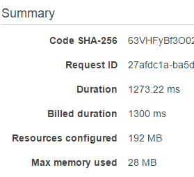

[](https://circleci.com/gh/guitarrapc/AWSLambdaCSharpIntroduction)

# AWSLambdaCSharpIntroduction

This is Sample project for AWS Lambad with .NET Core C#. May this repository help you understand AWS Lambda better.

# Recommend Lambda Functions settings for stability

- May be complex execution requires more than 128MB. Be careful with Max memory used.



# What you can know

This sample include following.

FunctionName | Language | Description
---- | ---- | ----
EnvironmentVariables | C# | Sample code to read Environment variable set in the AWS Lambda function.
GithubWebhook | C# | Github - Slack Integration with AWS Lambda sample.
SendToChatwork | C# | Send message to Chatwork sample.
SimpleClassFunction | C# | Simple minumum set of JSON Input sample.
SimpleAsyncFunction | C# | Simple minumum async/await with TEST for string Input sample. (SimpleAsyncFunction.Tests)
SlackSlashCommandWebhook | C# | Slack Slash Command sample with ```API Gateway```.
UnityCloudBuildNotificationProxy | C# | Unity Cloud build webhook notification to Chatwork sample with ```API Gateway``` + nested ```AWS Lambda```.

# Reference

http://tech.guitarrapc.com/archive/category/AWSLambda

# License

[MIT](https://github.com/guitarrapc/AzureFunctionsIntroduction/blob/master/LICENSE)
